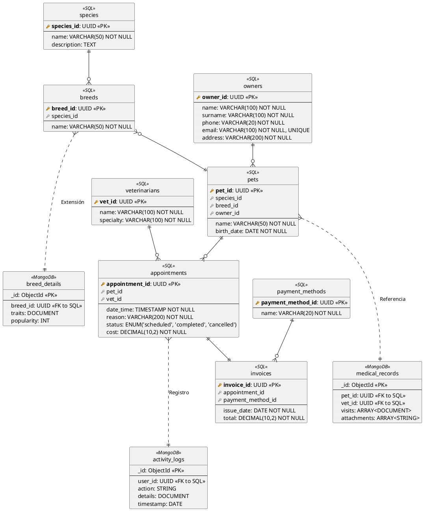
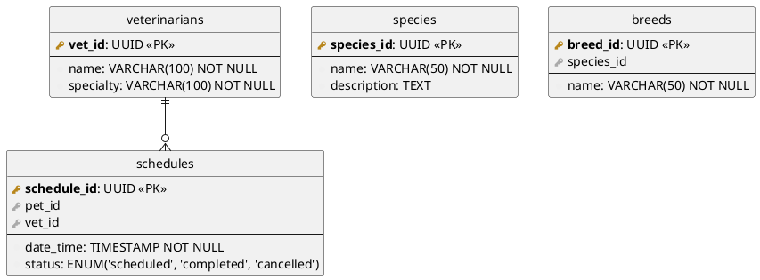

# Proyecto Personal

Este proyecto me ayudará a poner en práctica lo que voy aprendiendo.

Mi idea es armar un sistema de consultas para una veterinaria, el principio será para hacer consultas de mascotas con
sus dueños. La idea es hacerlo cada vez mas robusto con muchas funcionalidades.

TODO List

- [ ] Crear una DB para mascotas.
- [ ] Crear una DB para dueños.
- [ ] Diseñar clases de mascotas.
- [ ] Diseñar clases de dueños.
- [ ] Integrar DB con el programa.

## Creación de las tablas

Voy a utilizar MariaDB y MongoDB para las distintas bases.

### Modelos relacionales

