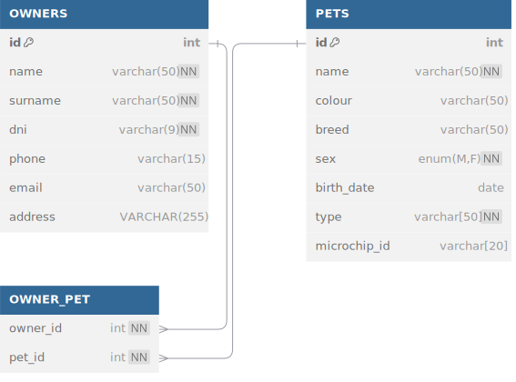

# Proyecto Personal

Este proyecto me ayudará a poner en práctica lo que voy aprendiendo.

Mi idea es armar un sistema de consultas para una veterinaria, el principio será para hacer consultas de mascotas con
sus dueños. La idea es hacerlo cada vez mas robusto con muchas funcionalidades.

TODO List

- [x] Crear una DB para mascotas.
- [x] Crear una DB para dueños.
- [ ] Diseñar clases de mascotas.
- [ ] Diseñar clases de dueños.
- [ ] Integrar DB con el programa.

## Creación de las tablas

Voy a utilizar MariaDB como gestor de mi DB.

Para la relación entre las tablas de mascotas y dueños decidí utilizar una relación **M:N**, ya que una misma mascota
puede tener varios dueños que lleven a tenderlo y por sobre todo me da una mayor escalabilidad.

Vamos a utilizar [bdiagram.io](https://dbdiagram.io/)

```dbml
Table OWNERS {
  id int [primary key]
  name varchar(50) [not null]
  surname varchar(50) [not null]
  dni varchar(9) [unique, not null]
  phone varchar(15)
  email varchar(50) [unique]
  address VARCHAR(255)
}

Table PETS {
  id int [primary key]
  name varchar(50) [not null]
  colour varchar(50)
  breed varchar(50)
  sex enum('M', 'F') [not null]
  birth_date date
  type varchar[50] [not null]
  microchip_id varchar[20] [unique]
}

Table OWNER_PET {
  owner_id int [not null, ref: > OWNERS.id]
  pet_id int [not null, ref: > PETS.id]
  indexes {
    (owner_id, pet_id) [unique]
  }
}
```



Código para MariaDB

```sql
CREATE TABLE `OWNERS` (
  `id` INT PRIMARY KEY AUTO_INCREMENT,
  `name` VARCHAR(50) NOT NULL,
  `surname` VARCHAR(50) NOT NULL,
  `dni` VARCHAR(9) UNIQUE NOT NULL,
  `phone` VARCHAR(15),
  `email` VARCHAR(50) UNIQUE,
  `address` VARCHAR(255)
);

CREATE TABLE `PETS` (
  `id` INT PRIMARY KEY AUTO_INCREMENT,
  `name` VARCHAR(50) NOT NULL,
  `colour` VARCHAR(50),
  `breed` VARCHAR(50),
  `sex` ENUM('M', 'F') NOT NULL,
  `birth_date` DATE,
  `type` VARCHAR(50) NOT NULL,
  `microchip_id` VARCHAR(20) UNIQUE
);

CREATE TABLE `OWNER_PET` (
  `owner_id` INT NOT NULL,
  `pet_id` INT NOT NULL,
  PRIMARY KEY (`owner_id`, `pet_id`)
);

ALTER TABLE `OWNER_PET` ADD FOREIGN KEY (`owner_id`) REFERENCES `OWNERS` (`id`) ON DELETE CASCADE;
ALTER TABLE `OWNER_PET` ADD FOREIGN KEY (`pet_id`) REFERENCES `PETS` (`id`) ON DELETE CASCADE;
```
